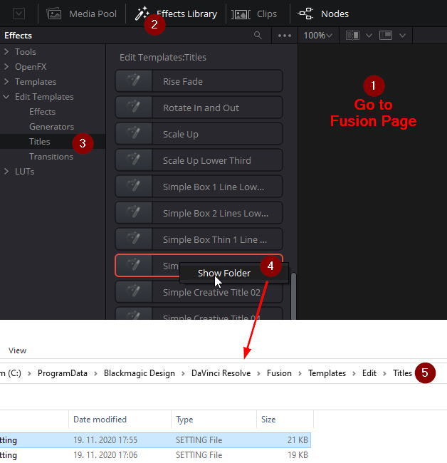

= DaVinci Resolve Notes

Video aspect ratio: 16:9
Photos aspect ratio: 3:2

If photo fits (matching height) with Transform Zoom = 1, then to fill the screen (matching width) the zoom must be:
(16/3)/(9/2) = 1.185185... or 1.1852 or 1.186 or 1.19 for full coverage.

== Directories organization

Either backup default database from `%APPDATA%/Blackmagic Design/DaVinci Resolve/Support/Resolve Disk Database/Resolve Projects`
or create a new one in "home screen" in already backed-up directory, e.g. `C:\work\video-projects\resolve-project-db`.

Other directories to check:

* Open *DaVinci Resolve | Preferences*, then *System* section *Media Storage* and set first directory to a path where
you want the cache files - probably something not backed-up, e.g. `C:\work\tmp\resolve-cache`.
Add other entries with media you normally use.

* In preferences, *User* section *Project Save and Load*, group *Save Settings* change *Project backup location*
to something out of backed-up dirs, e.g. `C:\work\tmp\resolve-cache\project-backups`.

* For existing projects, check *Project Settings* (bottom right cog wheel), *Master Settings*,
group *Working Folders* to values like `C:\work\tmp\resolve-cache\ProxyMedia`,
`CacheClip` (not sure about this one yet) and `C:\work\tmp\resolve-cache\.gallery`.

== TODO

How to hover above a map with rotation in place after translate?

== Title packs

There are at least three locations for Fusion titles in DaVinci Resolve:

* Under `DaVinci Resolve` installation folder (typically under `Program Files`)
and there the titles are under `Fusion/Templates/Edit/Titles`.
This is for default titles and I'd not install anything additional here.
* Under `ProgramData/Blackmagic Design/DaVinci Resolve` and then again the same
subdirectory as above - this is one option for globally added titles.
* And finally, under `$APPDATA/Blackmagic Design/DaVinci Resolve/Support` and
then again path starting with `Fusion/...` like before.
This is ideal for per-user installed titles.

Either of the latter options is suitable for additional custom titles.

To locate the directory with concrete custom title:

1. You must go to *Fusion Page* first.
2. Go to *Effects Library*.
3. Choose *Edit Templates/Titles*
4. Locate the title of interest, right-click and click *Show Folder*.
5. Folder with located title will open - in this case it's custom title under
`ProgramData`.

If you right click *Titles* in the navigation pane you can use *Show Folder*
there which takes you to the default location for custom titles *if no title
is selected in the list* (otherwise it takes you to the location of that title).
It is possible to move custom titles from `ProgramData` location to `$APPDATA`
without any harm (tested with DaVinci Resolve closed, of course).

See https://youtu.be/a1_DcaA_FtM[this video] for example how to install fonts.

[NOTE]
If the titles don't show up but the geometric stuff does, it's likely only
the fonts are missing.
Typically, they are mentioned in README and can be installed, but you can also
change the used font in the Inspector instead (results may vary, of course).

Used custom titles:

* https://motionarray.com/davinci-resolve-templates/simple-creative-titles-860872[Simple
Creative Titles] by vladoskin
