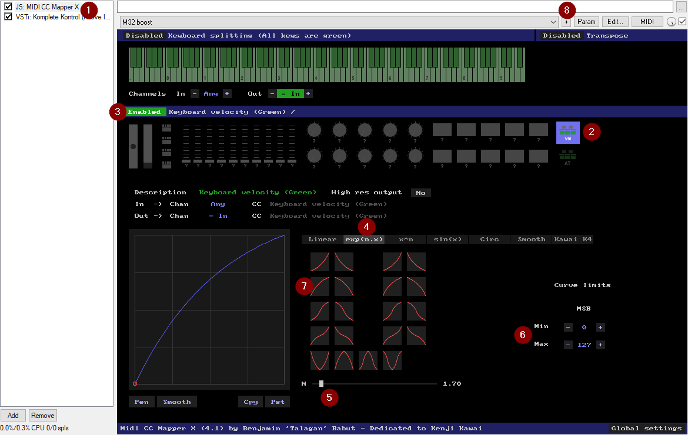

ifdef::env-github[]
:tip-caption: :bulb:
:note-caption: :information_source:
:important-caption: :heavy_exclamation_mark:
:caution-caption: :fire:
:warning-caption: :warning:
endif::[]
:toc:
:toc-placement!:

= REAPER notes

toc::[]

== Procedures

* Time selection for item: `Shift+double-click`
* Create region for time selection: `Shift+R`
* Edit region: `Shift+double-click`
* Render: `Ctrl+Alt+R`
** File name example: `snp10-$regionnumber-$region`

=== Envelopes

* 4-point envelope edit of selection: `Ctrl+Shift+drag`
* Envelope points:
** `Alt+click` delete
** `Ctrl+click/drag` freehand draw
** `Shift+drag` move without snap
** `Ctrl+Shift+drag` move in one axis only

== Good sounds

=== Long, effects

* Ethereal Earth - Frost Drone
* Giant
** Giant Noises; The Giant Cinematic the same, but drier; Tunnel Light more distant; Vortex with echo)
** Kataklysm, Orchestral Sphere, Overtone Reverse
** Phosphorescence (long, squeaking, going down later)
* Kinetic Metal (Alloy Cyclone, )

== Setup

To install plugins easily, check https://reapack.com/user-guide[ReaPack].

=== Midi velocity curve adjustment

For keyboards like Komplete Kontrol M32 it's handy to adjust velocity curve.
It can hardly fix the feeling and low responsiveness on the soft end, but it can help reach higher volume easier.

This can be done in many NI instruments directly, but that also changes the result
when keyboard with better sensitivity/feeling is used.
It is better to keep adjustments in a filter plugin that can be turned on and off.
For this we can use JS MIDI CC Mapper X which can be installed via ReaPack.

1. Insert the plugin before the instrument.
2. Click on the *Vel* function.
3. Enable the mapping so it shows *Enabled* - otherwise it shows *Disabled*.
4. Choose the type of the curve.
5. Choose the function parameter, the higher it is, the steeper or more extreme the curves are.
6. Choose the Min/Max value if needed.
7. Then click on the curve and it will display it in the pane on the left.
It will always adjust the shape based on the parameters after you click the shape.
8. Finally, save the preset.
